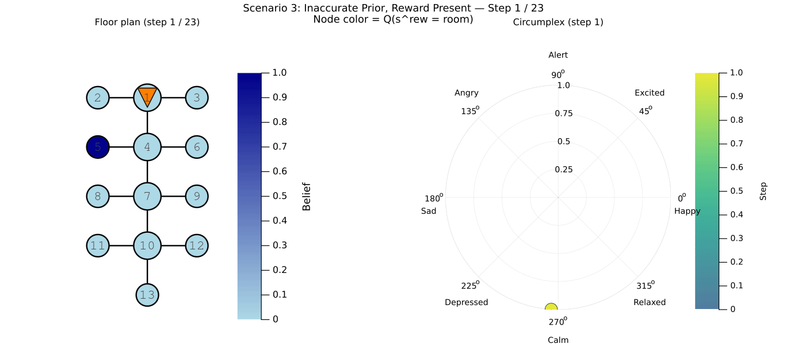

# Free Energy in a Circumplex Model of Emotion (Julia / RxInfer)

Julia implementation of the active-inference agent from [**"Free Energy in a Circumplex Model of Emotion"**](https://arxiv.org/abs/2407.02474) (Pattisapu et al., 2024), using reactive message passing in [RxInfer.jl](https://github.com/biaslab/RxInfer.jl).

A related PyMDP reference implementation lives in [af-ni](https://github.com/giovannifil-64/af-ni).

_This project is intended for educational and research purposes._

## The problem

An active-inference agent searches a **13-room floor plan** for a hidden reward. It can move between adjacent rooms; when co-located with the reward it may observe it. At each step we read out **valence** (prediction error) and **arousal** (belief uncertainty) and map them onto the circumplex of affect.

<p align="center">
  
</p>

<p align="center">
  <em>Environment: hub-and-spoke graph from the paper. The agent starts in room 1.</em>
</p>

Each run produces synchronized views of **where the agent thinks the reward is** (node color) and **how it feels** (circumplex trajectory). Below is **Scenario 3**: the reward is in room 9, but the prior is peaked at room 5—the agent must search, update beliefs, and move through affect states such as Calm → Angry → Alert → Relaxed.

<p align="center">
  
</p>

## Overview

Emotional state is computed each timestep from free-energy quantities:

- **Valence** — prediction error: realized utility minus expected utility
- **Arousal** — uncertainty: entropy of the posterior over reward location

> **Note:** This implementation uses **state-based preferences** (log-preferences over locations induced by beliefs about reward location), so the valence and arousal formulas are slightly adapted from those in the paper.

These map onto the **circumplex model of affect** (Russell, 1980): valence and arousal are normalized and plotted as polar coordinates to label regions such as Calm, Alert, Angry, and Relaxed.

| Angle | Emotion   | Valence | Arousal |
| ----- | --------- | ------- | ------- |
| 0°    | Happy     | High    | Neutral |
| 45°   | Excited   | High    | High    |
| 90°   | Alert     | Neutral | High    |
| 135°  | Angry     | Low     | High    |
| 180°  | Sad       | Low     | Neutral |
| 225°  | Depressed | Low     | Low     |
| 270°  | Calm      | Neutral | Low     |
| 315°  | Relaxed   | High    | Low     |

## Five experimental scenarios

The agent starts at room 1 and must find a hidden reward by moving on the graph.

| #   | Reward in world   | Prior over reward location                    |
| --- | ----------------- | --------------------------------------------- |
| 1   | Present (room 9)  | Uniform (`:vague`)                            |
| 2   | Present (room 11) | Peaked at room 11 (correct)                   |
| 3   | Present (room 9)  | Peaked at room 5 (incorrect)                  |
| 4   | Absent            | Uniform, with explicit “absent” state         |
| 5   | Absent            | Uniform, no “absent” state (misleading prior) |

Scenario 4 models uncertainty about absence; scenario 5 models a confident but wrong belief that the reward exists somewhere.

## Installation

### Prerequisites

- [Julia](https://julialang.org/) 1.10+ recommended
- Git

### Setup

```bash
git clone https://github.com/skoghoern/ArousalValencePOMDP.git
cd ArousalValencePOMDP
julia --project=. -e 'using Pkg; Pkg.instantiate()'
```

Main dependencies: `RxInfer`, `Distributions`, `Plots`, `LogExpFunctions`, `Tullio`.

## Usage

### Run all scenarios (plots + animations)

```bash
julia --project=. bin/run_scenarios.jl
```

Outputs are written under `data/<scenario_name>/` (circumplex plot, reward-belief heatmap, CSV timeseries, optional floorplan GIF).

### CLI options

```bash
julia --project=. bin/run_scenarios.jl --help

# Single scenario, no figures (CSV only)
julia --project=. bin/run_scenarios.jl --scenario 3 --time-horizon 80 --planning-horizon 6 --iterations 20

# One scenario with custom horizons
julia --project=. bin/run_scenarios.jl --scenario 2 --time-horizon 100 --planning-horizon 8
```

| Flag                       | Default | Description                    |
| -------------------------- | ------- | ------------------------------ |
| `--scenario`, `-s`         | `all`   | `1`–`5` or `all`               |
| `--time-horizon`, `-t`     | `80`    | Episode length                 |
| `--planning-horizon`, `-p` | `6`     | Lookahead for policy selection |
| `--iterations`, `-i`       | `20`    | VMP iterations per step        |
| `--visualize`, `-v`        | on      | Generate plots                 |
| `--animate`                | on      | Floorplan GIF                  |
| `--seed`                   | `42`    | RNG seed                       |

### Programmatic API

```julia
using Pkg; Pkg.activate("."); Pkg.instantiate()
using ArousalValencePOMDP

config = (time_horizon = 80, planning_horizon = 6, n_iterations = 20)

valences, arousals, rew_beliefs, locations, actions = run_circumplex_episode(
    1, 9, :vague, config;
    initialization_fn = efe_tmaze_agent_initialization,
    reward_absent = false,
)

plot_episode("Scenario 1", valences, arousals, rew_beliefs, locations, actions;
             reward_loc = 9, save_prefix = "scenario1")
```

The original exploratory notebook is kept as `Arousal_Valence_POMDP.ipynb`.

## Project structure

```
├── Project.toml / Manifest.toml
├── Arousal_Valence_POMDP.ipynb   # Source notebook
├── bin/
│   └── run_scenarios.jl          # CLI entry point
├── data/                         # Floor plan + sample outputs; full runs regenerate under data/
├── src/
│   ├── ArousalValencePOMDP.jl    # Module, exports, scenario registry
│   ├── environment.jl            # 13-room graph, actions, observations
│   ├── model.jl                  # RxInfer factor graph & custom nodes
│   ├── simulation.jl             # Episode loop, valence/arousal metrics
│   └── visualization.jl          # Circumplex, beliefs, floorplan animation
└── README.md
```

## License

MIT — see [LICENSE](LICENSE).

## References

- **Paper**: Pattisapu, N., Verbelen, T., Pitliya, R., Kiefer, A., & Albarracin, D. (2024). _Free Energy in a Circumplex Model of Emotion_. [arXiv:2407.02474](https://arxiv.org/abs/2407.02474)
- **Circumplex model**: Russell, J. A. (1980). A circumplex model of affect. _Journal of Personality and Social Psychology_, 39, 1161–1178. [DOI: 10.1037/h0077714](https://doi.org/10.1037/h0077714)
- **RxInfer**: [https://github.com/biaslab/RxInfer.jl](https://github.com/biaslab/RxInfer.jl)
- **PyMDP reference (Python)**: [af-ni](https://github.com/giovannifil-64/af-ni)
